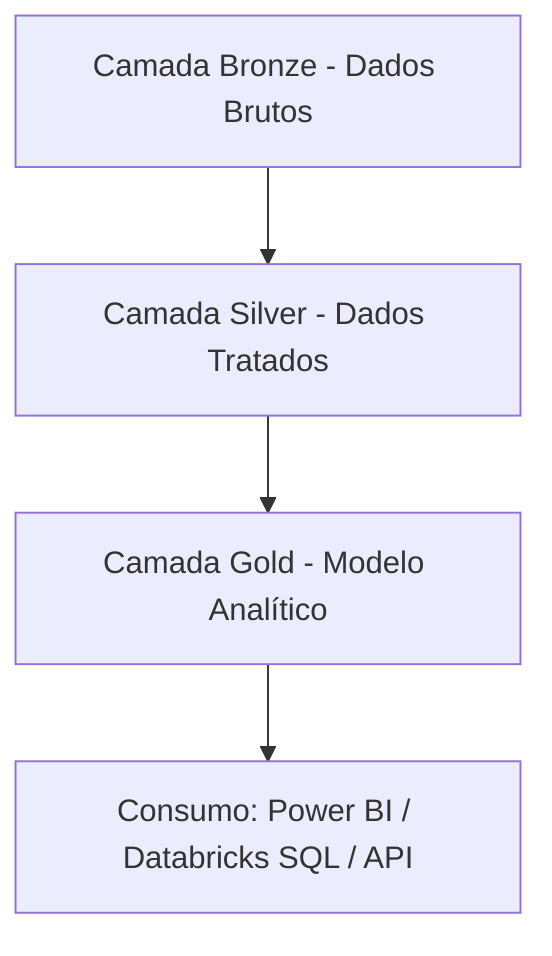

# 📁 Projeto de Engenharia de Dados - Pipeline Bronze → Silver → Gold

### 👨‍💼 Autor: Lucas Sousa Santos Oliveira
Especialista em Finanças em transição para Engenharia de Dados | Pós-graduação em Big Data e Cloud Computing

---

## 🎯 Objetivo do Projeto

Construir um pipeline de dados robusto e escalável utilizando Databricks com Delta Lake, que implemente as boas práticas modernas de ingestão, tratamento, enriquecimento e entrega de dados em múltiplas camadas (Bronze → Silver → Gold), garantindo performance, rastreabilidade e governança de dados para consumo analítico.

---

## 🧱 Arquitetura em Camadas

---

## 🔽 Camada Bronze (Ingestão e Explosão de Dados)

### 🛠️ Transformações Aplicadas
- 🔁 **Explode de arrays**: transforma múltiplos itens por pedido em múltiplas linhas (`explode(Items)`) para granularidade analítica.
- 🔍 **Extração de nested fields**: acesso e projeção de colunas internas como `ShippingAddress.City`, `Item.Price`, etc.
- 🏷️ **Padronização de colunas** com `alias()` para consistência semântica.
- 📅 **Particionamento por data** (`OrderDate`) para acelerar filtros temporais.
- ⛓️ **Registro dinâmico no catálogo** com verificação condicional e criação automática da tabela Delta caso ainda não exista.

### ⚙️ Técnicas Avançadas Utilizadas
| Técnica                      | Benefício                                                                 |
|-----------------------------|---------------------------------------------------------------------------|
| 🔄 `Auto Loader (cloudFiles)` | Ingestão incremental com detecção automática de arquivos Delta            |
| 🎯 `explode()`              | Permite granularidade por item, essencial para análises de vendas         |
| 🧊 `Delta Lake`             | Suporte a transações ACID, time travel e schema evolution                 |
| 🧭 `checkpointLocation`     | Garante consistência e retomada segura em caso de falha                   |
| 📊 `ZORDER BY`              | Otimiza leitura por `OrderID` e `CustomerID`                              |
| 🔍 `Verificação condicional`| Criação da tabela no catálogo apenas quando necessário                    |

### 🧪 Validação Final
- ✅ Contagem de registros gravados.
- 🚀 Otimização com `OPTIMIZE ZORDER`.
- 📚 Registro automático no catálogo Hive/Unity Catalog.

---

## 🪄 Camada Silver (Tratamento, Enriquecimento e Modelagem)

### 🛠️ Principais Transformações
- 🔄 Conversão de tipos (`OrderDate` para `Date`) para facilitar análises temporais.
- ❌ Remoção de colunas ambíguas e irrelevantes (`Date_Time_Load`).
- 🧹 Limpeza de duplicatas e valores nulos (`dropDuplicates()` + `na.drop()`).
- 🔗 **Desnormalização com joins**: enriquecimento entre vendas e clientes via `CustomerID`.
- 🧾 Padronização com ordenação explícita de colunas.
- 🕒 Inclusão de campo de auditoria (`last_updated`) com `current_timestamp()`.
- 🔄 Reparticionamento por `OrderDate` para performance de escrita e leitura.

### ⚙️ Técnicas Avançadas Utilizadas
| Técnica                     | Benefício                                                               |
|----------------------------|-------------------------------------------------------------------------|
| 🔄 `DeltaTable.merge()`     | Garantia de atualização incremental sem sobrescrita total               |
| 📦 `broadcast join`         | Otimização de joins entre tabelas de tamanhos desbalanceados           |
| 🧹 `dropDuplicates()` + `na.drop()` | Remoção de dados inconsistentes ou incompletos               |
| 🧊 `cache()`                | Evita recomputação em múltiplas transformações                         |
| 🧱 `OPTIMIZE ZORDER`        | Organiza fisicamente os dados para leitura eficiente por colunas-chave  |
| 🧼 `VACUUM`                 | Libera espaço removendo arquivos obsoletos                              |
| 📚 `Registro no metastore` | Permite acesso governado via SQL, notebooks e Power BI                 |

---

## 🥇 Camada Gold (Modelo Dimensional e Fato de Vendas)

### 📐 Dimensão Cliente

#### 🎯 Objetivo
- 🙋‍♂️ Dados únicos e limpos por `CustomerID`.
- 🕒 Inclusão de campo de auditoria (`Created_at`).
- 🔄 Atualizações eficientes com `MERGE Delta`.
- 🚀 Otimização com `Z-ORDER` e particionamento por `Country`, `State`.

#### ⚙️ Etapas
1. Criação do banco `gold` (se não existir).
2. Leitura da Silver com dados desnormalizados.
3. Reparticionamento por `Country`, `State`.
4. Limpeza com `dropDuplicates()` + `na.drop()`.
5. Inclusão do campo `Created_at`.
6. Cache para otimização de múltiplas etapas.
7. Auditoria com contagem antes e depois do `MERGE`.
8. Escrita com `MERGE` baseado em `CustomerID`.
9. `OPTIMIZE ZORDER` e `VACUUM`.
10. Registro no catálogo.

#### ✅ Técnicas Aplicadas
- `MERGE Delta`, `partitionBy`, `cache`, `Z-ORDER`, `VACUUM`, `registro no metastore`

---

### 📐 Dimensão Produto

#### 🎯 Objetivo
- 📦 Dados únicos por `ItemID`
- 📈 Estrutura otimizada para filtros e análises de produto
- 🔄 MERGE Delta + Created_at para rastreabilidade
- Particionamento por `ItemID` (100 partições)

#### ⚙️ Etapas
1. Leitura da Silver com controle de partição
2. Seleção de `ItemID`, `ProductName`
3. Remoção de duplicatas e nulos
4. Inclusão do `Created_at`
5. `cache()` e contagem antes/depois
6. Escrita com `MERGE` baseado em `ItemID`
7. Otimização com `Z-ORDER(ItemID)`
8. `VACUUM` e registro no catálogo

#### ✅ Técnicas Aplicadas
- `MERGE`, `dropDuplicates`, `partitionBy`, `Z-ORDER`, `registro no catálogo`

---

### 📐 Fato Vendas

#### 🎯 Objetivo
- 🧾 Garantir unicidade por `OrderID` + `ItemID`
- 💰 Consolidar métricas: `TotalAmount`, `Price`, `Quantity`
- 🕒 Rastreabilidade com `Created_at`
- 🔄 Atualização via `MERGE` com controle de duplicidade

#### ⚙️ Etapas
1. Criação do banco gold
2. Leitura da Silver (tabela desnormalizada)
3. Geração de `Created_at`
4. Geração de `hash_value` com `sha2()` para identificar duplicatas
5. `dropDuplicates(hash)` e `window()` para manter registros mais recentes
6. Auditoria (contagem antes/depois)
7. Escrita com `MERGE (OrderID + ItemID)`
8. `Z-ORDER(OrderID)`, `VACUUM` e registro no catálogo

#### ✅ Técnicas Aplicadas
- `MERGE`, `sha2(hash)`, `dropDuplicates`, `window`, `cache`, `Z-ORDER`, `VACUUM`, `registro no catálogo`

---

## 📈 Monitoramento e Qualidade

- 🔍 **Expectations com Delta Live Tables** para validação automática de regras de qualidade
- 🔔 **Alertas** com Jobs + notificações
- 🧾 **Logs e métricas de execução** persistidos em Delta Lake

---

## 🧠 Conclusão

Este projeto demonstra a construção de uma arquitetura Lakehouse completa com separação lógica e física de dados, automação de ingestão, transformação confiável, e preparação otimizada para consumo analítico com governança. As técnicas aplicadas — como `MERGE`, `Z-ORDER`, `Auto Loader`, `partitionBy`, `broadcast join`, `cache`, `VACUUM`, e `checkpoint` — evidenciam domínio profundo da stack Spark/Delta Lake e boas práticas modernas de engenharia de dados em nuvem.

> "Engenharia de dados é mais do que mover bits — é sobre criar pontes entre dados brutos e decisões inteligentes."
