 📁 Projeto de Engenharia de Dados - Pipeline Bronze → Silver → Gold

### 👨‍💼 Autor: Lucas Sousa Santos Oliveira
Especialista em Finanças em transição para Engenharia de Dados | Pós-graduação em Big Data e Cloud Computing

---

## 🎯 Objetivo do Projeto

Construir um pipeline de dados robusto e escalável utilizando Databricks com Delta Lake, que implemente as boas práticas modernas de ingestão, tratamento, enriquecimento e entrega de dados em múltiplas camadas (Bronze → Silver → Gold), garantindo performance, rastreabilidade e governança de dados para consumo analítico.

---

## 🧱 Arquitetura em Camadas

```mermaid
graph TD
  A[Camada Bronze - Dados Brutos] --> B[Camada Silver - Dados Tratados]
  B --> C[Camada Gold - Modelo Analítico]
  C --> D[Consumo: Power BI / Databricks SQL / API]
```

---

## 🔽 Camada Bronze (Ingestão e Explosão de Dados)

### 🛠️ Transformações Aplicadas
- 🔁 **Explode de arrays**: transforma múltiplos itens por pedido em múltiplas linhas (`explode(Items)`) para granularidade analítica.
- 🔍 **Extração de nested fields**: acesso e projeção de colunas internas como `ShippingAddress.City`, `Item.Price`, etc.
- 🏷️ **Padronização de colunas** com `alias()` para consistência semântica.
- 📅 **Particionamento por data** (`OrderDate`) para acelerar filtros temporais.
- ⛓️ **Registro dinâmico no catálogo** com verificação condicional e criação automática da tabela Delta caso ainda não exista.

### ⚙️ Técnicas Avançadas Utilizadas
| Técnica                      | Benefício                                                                 |
|-----------------------------|---------------------------------------------------------------------------|
| 🔄 `Auto Loader (cloudFiles)` | Ingestão incremental com detecção automática de arquivos Delta            |
| 🎯 `explode()`              | Permite granularidade por item, essencial para análises de vendas         |
| 🧊 `Delta Lake`             | Suporte a transações ACID, time travel e schema evolution                 |
| 🧭 `checkpointLocation`     | Garante consistência e retomada segura em caso de falha                   |
| 📊 `ZORDER BY`              | Otimiza leitura por `OrderID` e `CustomerID`                              |
| 🔍 `Verificação condicional`| Criação da tabela no catálogo apenas quando necessário                    |

### 🧪 Validação Final
- ✅ Contagem de registros gravados.
- 🚀 Otimização com `OPTIMIZE ZORDER`.
- 📚 Registro automático no catálogo Hive/Unity Catalog.

---

## 🪄 Camada Silver (Tratamento, Enriquecimento e Modelagem)

### 🛠️ Principais Transformações
- 🔄 Conversão de tipos (`OrderDate` para `Date`) para facilitar análises temporais.
- ❌ Remoção de colunas ambíguas e irrelevantes (`Date_Time_Load`).
- 🧹 Limpeza de duplicatas e valores nulos (`dropDuplicates()` + `na.drop()`).
- 🔗 **Desnormalização com joins**: enriquecimento entre vendas e clientes via `CustomerID`.
- 🧾 Padronização com ordenação explícita de colunas.
- 🕒 Inclusão de campo de auditoria (`last_updated`) com `current_timestamp()`.
- 🔄 Reparticionamento por `OrderDate` para performance de escrita e leitura.

### ⚙️ Técnicas Avançadas Utilizadas
| Técnica                     | Benefício                                                               |
|----------------------------|-------------------------------------------------------------------------|
| 🔄 `DeltaTable.merge()`     | Garantia de atualização incremental sem sobrescrita total               |
| 📦 `broadcast join`         | Otimização de joins entre tabelas de tamanhos desbalanceados           |
| 🧹 `dropDuplicates()` + `na.drop()` | Remoção de dados inconsistentes ou incompletos               |
| 🧊 `cache()`                | Evita recomputação em múltiplas transformações                         |
| 🧱 `OPTIMIZE ZORDER`        | Organiza fisicamente os dados para leitura eficiente por colunas-chave  |
| 🧼 `VACUUM`                 | Libera espaço removendo arquivos obsoletos                              |
| 📚 `Registro no metastore` | Permite acesso governado via SQL, notebooks e Power BI                 |

---

## 🥇 Camada Gold (Modelo Dimensional e Fato de Vendas)

[...continua com as outras seções, como no texto completo acima...]

