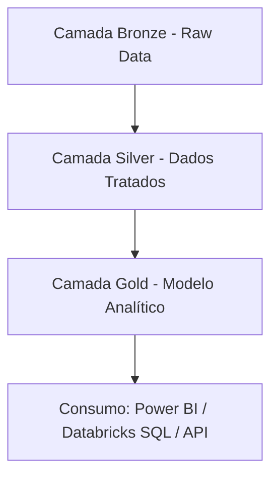

## 📁 Projeto de Engenharia de Dados - Pipeline Bronze → Silver → Gold

### 👨‍💼 Autor: Lucas Sousa Santos Oliveira
Especialista em Finanças em transição para Engenharia de Dados | Pós-graduação em Big Data e Cloud Computing

---

## 🎯 Objetivo do Projeto
Criar um pipeline de dados robusto, escalável e otimizado usando Databricks e Delta Lake, com foco em boas práticas de ingestão, processamento e entrega de dados para analytics e decisões de negócio.

---

## 🧱 Arquitetura em Camadas

---

## 🔽 Camada Bronze (Ingestão)

### ✅ Responsável por:
- Capturar dados brutos de múltiplas fontes (CSV, APIs, arquivos externos).
- Armazenar em Delta Lake mantendo fidelidade com a fonte.

### ✅ Melhorias aplicadas:
- 📥 **Auto Loader com trigger(once)** para leitura eficiente e econômica.
- 🧹 Pré-tratamento básico: `dropDuplicates`, `na.drop()`
- 📁 Particionamento por data (`partitionBy("data_carga")`).
- 💾 Salvamento em formato Delta Lake com schema evolution.

---

## 🪄 Camada Silver (Transformação)

### ✅ Responsável por:
- Normalizar os dados, aplicar consistência e enriquecer com joins.
- Aplicar lógicas de negócio (ex: status, flags, filtros de qualidade).

### 🔍 Técnicas usadas:
- Join com dimensões (cliente, produto).
- Criação de colunas de rastreabilidade (`created_at`, `hash_id`).
- Validações de qualidade (status válidos, tipos consistentes).

---

## 🥇 Camada Gold (Modelo Analítico)

### ✅ Responsável por:
- Entregar dados prontos para dashboards, relatórios e APIs.
- Atender ao modelo dimensional (tabelas fato e dimensão).

### 🧠 Entregas chave:
- Fato Vendas com métricas normalizadas
- Dimensões limpas e auditáveis
- Views para consumo por BI

---

## 🚀 Otimizações Spark Aplicadas

| Técnica                       | Benefício                                        
|------------------------------|-------------------------------------------------|
| Auto Loader                  | Leitura incremental e eficiente                 |
| Trigger Once / AvailableNow  | Economia de cluster em batch                    |
| PartitionBy                  | Redução de I/O e ganho de leitura               |
| Checkpoint Location          | Tolerância a falhas em stream                   |
| Round / cast tipos           | Redução de processamento no Gold                |
| Delta Format                 | ACID, time travel e performance                 |

---

## 📊 Monitoramento e Qualidade

- Delta Live Tables com **Expectations**
- Alertas com Databricks Jobs e notificações
- Logs de execução persistidos em Delta

---

## 📈 Evolução para Projeto Avançado

### Etapas sugeridas:

1. **Streaming com Auto Loader** e monitoramento contínuo.
2. **Data Quality em tempo real** com Delta Live Tables.
3. **Ingestão de múltiplas fontes** (API, Webhooks, bancos relacionais).
4. **Governança com Unity Catalog**.
5. **Pipelines agendados com Databricks Workflows**.
6. **Views de Consumo em Databricks SQL + Power BI**.
7. **Versões automatizadas com GitHub + CI/CD**.

---

## 🧠 Conclusão
Este projeto evolui de uma ingestão simples de arquivos CSV para uma arquitetura escalável, segura e de alto valor analítico. Com técnicas modernas de engenharia de dados aplicadas, está pronto para suportar decisões estratégicas em ambientes corporativos.

> "Engenharia de Dados é mais do que mover bits — é sobre criar pontes entre dados brutos e decisões inteligentes."

---

